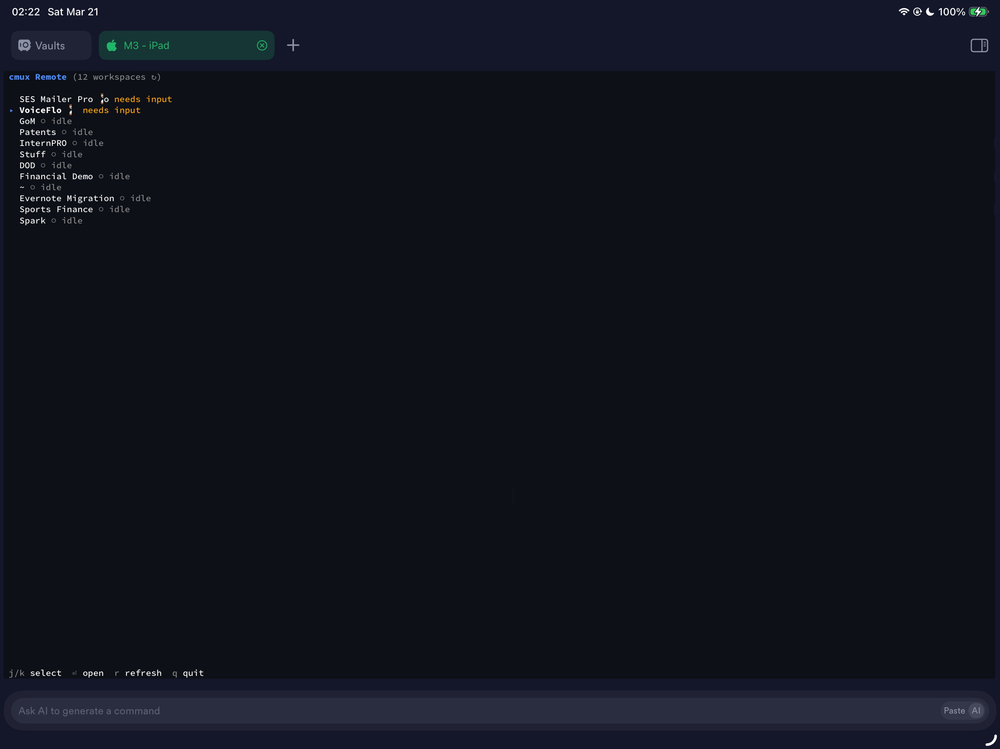
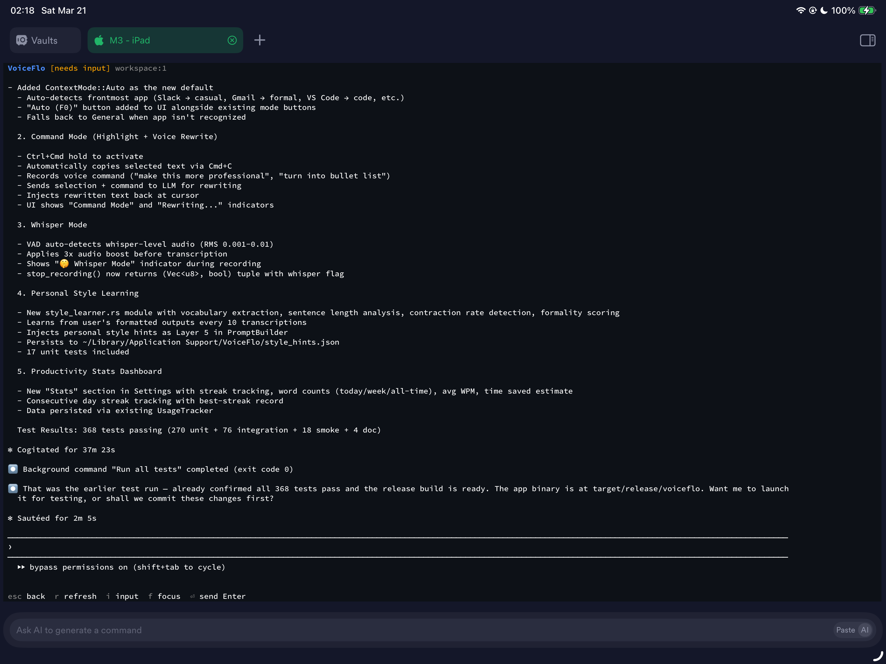

# cmux-tui

A terminal UI for remotely controlling [cmux](https://cmux.com) workspaces over SSH, designed for managing your agentic coding sessions from an iPad or iPhone.

Monitor and control your running terminal sessions — whether they're [Claude Code](https://docs.anthropic.com/en/docs/claude-code), [OpenCode](https://github.com/anomalyco/opencode), [Codex](https://github.com/openai/codex), [Aider](https://aider.chat), [Droid](https://github.com/nichochar/droid), or any other agentic tool running in cmux — from anywhere with a lightweight, responsive TUI built with [OpenTUI](https://github.com/anomalyco/opentui) and [Bun](https://bun.sh).

---

## Why We Built This

We built cmux-tui for ourselves. We run a bunch of agentic coding sessions in cmux throughout the day, and we wanted a way to check in on them from our iPad or iPhone without having to walk back to the Mac. What started as a quick hack turned into something we actually use every day — so we figured we'd share it in case it helps others too.

If you're curious about how we use cmux to juggle multiple AI coding agents at once, check out [this LinkedIn post](https://www.linkedin.com/posts/fvongraf_cmux-the-terminal-built-for-multitasking-activity-7440850191001264128-yfFx) where we talk about the workflow.

---

## Screenshots

| Dashboard | Workspace Detail |
|:---------:|:----------------:|
|  |  |

*Running on iPad over SSH — monitoring 12 workspaces from the couch.*

---

## Features

**Dashboard View**
- List all cmux workspaces with live status indicators
- Color-coded status: ⚡ Running, ⏳ Needs Input, ○ Idle
- Auto-refresh every 5 seconds
- Filter workspaces by status (`/` to cycle: all → running → needs input → idle)
- Status change notifications — get alerted when a workspace changes state (toggle with `n`)
- Clean, keyboard-driven navigation

**Detail View**
- Read terminal screen content from any workspace
- Auto-refresh every 3 seconds (toggle with `Ctrl+A`) — no more manual refreshing
- See what's currently running in real-time
- **Direct typing** — just start typing to compose a command, press Enter to send. No mode switching needed.
- Send `Ctrl+C` directly to workspaces to interrupt running processes
- Tab key support for shell autocomplete

**Quick Macros** (`Ctrl+T` from detail view)
- One-keystroke actions for common agentic tool commands
- Pre-configured: approve (y), deny (n), Ctrl+C, resume, /status, /clear, /compact, /help
- Works with Claude Code, OpenCode, Aider, and other tools that use similar commands

**Session Tree** (`t` from dashboard)
- View the full cmux session tree (`cmux tree --all`)
- See all workspaces and their hierarchy at a glance

**Focus Control**
- Switch which workspace is active on your Mac's display
- Seamlessly manage multiple projects

---

## Quick Start

### Prerequisites

- **macOS** with [cmux installed](https://cmux.com/download)
- **Bun** runtime ([install Bun](https://bun.sh))
- **SSH server** enabled on your Mac
  - System Settings → General → Sharing → Remote Login → Enable
- **cmux configured** for remote access (see [Socket Authentication](#socket-authentication))
- **CMUX_SOCKET_PASSWORD** environment variable set

### Installation

**Automated:**
```bash
curl -fsSL https://raw.githubusercontent.com/W4M-ai/cmux-tui/main/install.sh | bash
```

**Manual:**
```bash
git clone https://github.com/W4M-ai/cmux-tui.git ~/.cmux-tui
cd ~/.cmux-tui
bun install

# Add to PATH
echo 'export PATH="$HOME/.cmux-tui:$PATH"' >> ~/.zshenv

# Set password (required)
echo 'export CMUX_SOCKET_PASSWORD="your-password"' >> ~/.zshenv

# Reload shell
source ~/.zshenv
```

### Running

**TUI Dashboard:**
```bash
cmux-tui
```

**Quick CLI Commands (cx helper):**
```bash
cx                    # List all workspaces
cx tree               # Show full session tree
cx status             # Display workspace statuses
cx focus myworkspace  # Switch active workspace
cx read myworkspace   # Read workspace screen content
cx run myworkspace "ls -la"  # Send command to workspace
```

---

## How It Works

```
┌─────────────┐
│  iPad/Phone │
│  SSH Client │
└──────┬──────┘
       │ SSH Connection
       │ Port 22
       ▼
┌─────────────────────────────┐
│   Your Mac               │
│                         │
│  ┌──────────────────┐  │
│  │   cmux-tui       │  │
│  │  (TUI Dashboard) │  │
│  └────────┬─────────┘  │
│           │            │
│           │ Unix Socket│
│           │ (encrypted)│
│  ┌────────▼─────────┐  │
│  │      cmux        │  │
│  │  (Workspaces &   │  │
│  │   Claude Code)   │  │
│  └──────────────────┘  │
│                         │
└─────────────────────────────┘
```

**The architecture:**

1. **TUI runs on your Mac** – cmux-tui is a native OpenTUI application running locally
2. **You SSH in from mobile** – Connect from iPad/iPhone using any SSH client
3. **Secure socket communication** – TUI talks to cmux via a password-protected Unix socket
4. **Real-time workspace control** – Send commands, switch focus, monitor status in real-time

---

## Socket Authentication

To allow SSH sessions to control cmux remotely, you must enable password-protected socket access:

1. **Open cmux Settings** on your Mac
2. **Scroll to "Automation" section**
3. **Change "Socket Control Mode"** from "cmux processes only" to "Password mode"
4. **Set a password** and save it
5. **Export the password** in your shell:
   ```bash
   export CMUX_SOCKET_PASSWORD="your-password"
   ```
   Add this to `~/.zshenv` (or `~/.bash_profile` for bash) to persist it.

**Why this is needed:** By default, cmux only allows processes started inside cmux to connect to its socket. Password mode allows external processes (like your SSH session) to authenticate and connect.

---

## Key Bindings

### Dashboard

| Key | Action |
|-----|--------|
| `j` / `↓` | Move cursor down |
| `k` / `↑` | Move cursor up |
| `Enter` | Open workspace detail |
| `/` | Cycle filter (all → running → needs input → idle) |
| `t` | Open session tree view |
| `n` | Toggle notifications on/off |
| `r` | Refresh workspace list |
| `q` | Quit application |

### Detail View (Direct Typing)

The detail view uses direct typing — just start typing and your keystrokes go to the input buffer. No mode switching needed. All commands use `Ctrl+` combos to stay out of your way.

| Key | Action |
|-----|--------|
| Type text | Compose a command in the input buffer |
| `Enter` | Send buffer contents to workspace (or just Enter if empty) |
| `Backspace` | Delete last character from buffer |
| `Tab` | Send Tab to workspace (shell autocomplete) |
| `Ctrl+R` | Refresh screen content |
| `Ctrl+A` | Toggle auto-refresh (every 3s) |
| `Ctrl+T` | Open quick macros menu |
| `Ctrl+F` | Focus this workspace on Mac |
| `Ctrl+C` | Send Ctrl+C to workspace (interrupt) |
| `Esc` | Clear input buffer, or return to dashboard if empty |

### Quick Macros

| Key | Action |
|-----|--------|
| `1` | Send `y` + Enter (approve) |
| `2` | Send `n` + Enter (deny) |
| `3` | Send Ctrl+C (interrupt) |
| `4` | Send `resume` + Enter |
| `5` | Send `/status` + Enter |
| `6` | Send `/clear` + Enter |
| `7` | Send `/compact` + Enter |
| `8` | Send `/help` + Enter |
| `Esc` | Back to detail view |

### Session Tree

| Key | Action |
|-----|--------|
| `r` | Refresh tree |
| `Esc` | Return to dashboard |

---

## iOS SSH Tips

### Terminal Apps

We recommend these SSH clients for iOS:

- **[Blink Shell](https://blinkshell.com/)** – Feature-rich, customizable, great keyboard support
- **[Termius](https://www.termius.com/)** – User-friendly, good UI, cross-platform
- **Prompt 3** – Well-designed, popular among developers

### Escape Key

The Escape key is critical for cmux-tui navigation. In most iOS terminal apps:

```
Escape = Ctrl + [
```

Configure your SSH app to map `Escape` to `Ctrl+[` if not already set.

### Terminal Width Adaptation

cmux-tui automatically adapts to your terminal width:

- **iPhone** (narrow ~40 columns) – Compact view, abbreviated status
- **iPad** (wide ~80+ columns) – Full dashboard with detailed information

Rotate your device to adjust the layout in real-time.

### Connection Tips

- **Keep-alive:** Enable SSH keep-alive in your terminal app settings to prevent disconnections
- **Font size:** Use a monospace font at 11-13pt for readability
- **Auto-lock:** Configure your iOS device to not auto-lock while using SSH
- **Clipboard:** Most terminal apps support clipboard paste via long-press

---

## Troubleshooting

### Socket Connection Failed

```
Error: Unable to connect to cmux socket
```

**Check:**
1. `echo $CMUX_SOCKET_PASSWORD` – Is the password exported?
2. cmux Settings → Automation → Socket Control Mode is set to "Password mode"
3. cmux is actually running on your Mac
4. Try `cx status` to test the connection

### Commands Not Executing

```
Error: Timeout sending command to workspace
```

**Check:**
1. Is the workspace actually running? (Check `cx tree`)
2. Does the workspace need input? (Status shows ⏳ Needs Input)
3. Try sending a simple command first: `cx run myworkspace "echo test"`

### SSH Connection Drops

1. Enable keep-alive in your SSH client settings
2. Check that your iOS device isn't auto-locking
3. Try SSHing in again with `-v` flag for verbose debugging

### Port 22 Not Accessible

```
ssh: connect to host example.com port 22: Connection refused
```

**On your Mac:**
1. System Settings → General → Sharing
2. Scroll to "Remote Login"
3. Click the toggle to enable it
4. Note your hostname: `System Settings → General → About → Local Hostname`

To SSH in: `ssh username@hostname.local`

---

## Two Tools

### 1. cmux-tui (TUI Dashboard)

The main interactive dashboard for managing workspaces.

```bash
cmux-tui
```

Features:
- Real-time workspace overview
- Interactive navigation
- Live screen content viewing
- Remote command execution
- Workspace focus control

### 2. cx (CLI Helper)

Quick command-line tool for scripting and one-off operations.

```bash
cx              # List workspaces
cx tree         # Full session tree
cx status       # All workspace statuses
cx focus NAME   # Switch workspace (fuzzy match)
cx read NAME    # Read workspace screen
cx run NAME CMD # Send command (fuzzy match)
```

All `cx` commands support fuzzy matching on workspace names, so you don't need the exact name.

---

## Tech Stack

- **OpenTUI** – Zig-native terminal UI framework
- **Bun** – JavaScript runtime and package manager
- **TypeScript** – Type-safe implementation

---

## Development

### Setup

```bash
git clone https://github.com/W4M-ai/cmux-tui.git
cd cmux-tui
bun install
```

### Run (Development Mode)

```bash
bun run dev
```

This enables hot reloading for faster development.

### Run (Production)

```bash
bun run start
```

### Test

```bash
bun test
```

---

## Contributing

Feel free to fork this and make it your own! We built this for our personal workflow and are sharing it as-is. We unfortunately don't have the bandwidth to review PRs or provide support, but you're welcome to take it in whatever direction works for you.

---

## License

MIT License – see [LICENSE](LICENSE) file for details.

---

## Resources

- [cmux Documentation](https://cmux.com)
- [Bun Documentation](https://bun.sh/docs)
- [OpenTUI Documentation](https://opentui.dev)
- [GitHub Repository](https://github.com/W4M-ai/cmux-tui)

---

## Acknowledgments

This project wouldn't exist without:

- **[cmux](https://github.com/manaflow-ai/cmux)** by Manaflow AI — the terminal multiplexer that makes this all possible. cmux's powerful CLI and socket API are what enable remote workspace control. Huge thanks to the cmux team for building such a solid foundation.
- **[OpenTUI](https://github.com/anomalyco/opentui)** by Anomaly — the Zig-native terminal UI framework that powers the dashboard. OpenTUI's performance and component model made it possible to build a responsive TUI that works great even over SSH on mobile connections. Built by the same team behind [OpenCode](https://github.com/anomalyco/opencode).
- **[Bun](https://bun.sh)** — for making TypeScript development fast and painless.

Built for developers who run agentic coding tools and want to keep projects moving from anywhere — even from the couch with an iPad. 🛋️

We'd love to hear how you use it! Open an issue on [GitHub](https://github.com/W4M-ai/cmux-tui/issues) with questions, ideas, or just to say hi.
